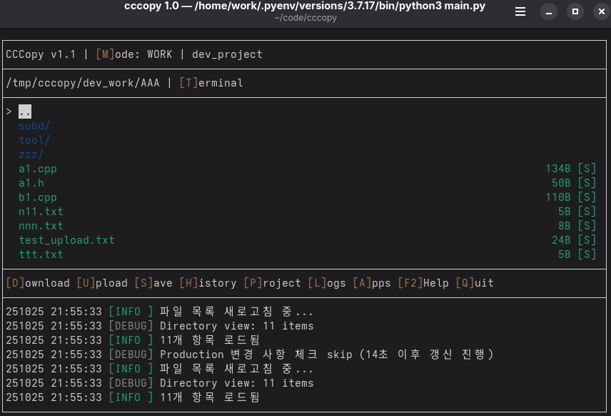
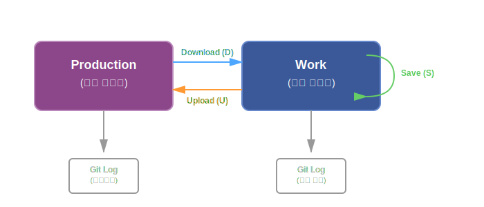

# CCCopy

NFS 환경에서 이중 Git 저장소(Work & Production)를 관리하는 팀 협업 도구

## 개요

CCCopy는 Python 기반 Git 래퍼 도구로, 다음 기능을 제공합니다:
- **이중 저장소 관리**: Work(개인) 및 Production(공유) 저장소 분리
- **NFS 안전 락**: 동시 접근 제어를 위한 디렉토리 기반 락 매니저
- **스마트 파일 상태 추적**: Git hash 기반 비교로 6가지 파일 상태 관리
- **원자적 권한 관리**: 필요시에만 밀리초 단위로 권한 상승
- **정확한 Git Author 추적**: 다중 사용자 환경에서 `--author` 플래그로 정확한 커밋 기록

## 주요 특징

### 이중 Git 저장소 시스템
- **Work 저장소**: 개인 작업 공간
- **Production 저장소**: 공유 프로덕션 환경
- 충돌 감지 기능을 갖춘 지능형 저장소 간 동기화

### NFS 안전 동시 접근
- 디렉토리 기반 락 매니저 (스테일 락 자동 정리, 5분 타임아웃)
- 공유 Production 저장소에 대한 안전한 다중 사용자 접근
- 실패시 자동 롤백 기능의 원자적 작업

### 지능형 파일 상태 관리
- **6가지 파일 상태**: same, modified, updated, conflicted, pending, deleted
- Git hash 기반 비교 (CRC32에서 개선)
- 실시간 파일 변경 감지 및 자동 새로고침

### 보안 및 권한
- **원자적 권한 상승**: Production 작업시에만 최소 권한 상승
- **Work 보호**: 모든 Work 작업은 원래 사용자 권한으로 실행
- **감사 로깅**: 모든 권한 변경에 대한 상세 로그
- **실패 안전 설계**: 권한 복귀 실패시 치명적 오류로 중단

### 정확한 Git Author 추적
- **Production**: 모든 커밋에 `--author` 플래그 사용 (실제 사용자 신원)
- **Dummy Committer**: Production git config는 `cccopy_admin <admin@cccopy.com>` 고정
- **Work**: 개인 git config 사용
- **다중 사용자 대응**: 누가 언제 무엇을 수정했는지 추적

### 현대적인 TUI 인터페이스
- 실시간 로그 표시 기능의 Curses 기반 대화형 인터페이스
- 펼치기/접기 기능의 파일 트리 네비게이션
- 빠른 시각적 식별을 위한 파일 상태별 색상 구분
- 모든 작업에 대한 키보드 단축키

### 다중 프로젝트 관리
- `project/*.ini` 파일 기반 템플릿으로 프로젝트 생성
- 전역 환경설정과 프로젝트별 개별 설정
- 빠른 프로젝트 전환 및 복제
- SOURCES 및 EXCLUDES 패턴 커스터마이징 가능

### 완전한 유니코드 지원
- 정확한 CJK (한글, 중문, 일문) 문자 폭 처리
- 모든 다이얼로그에서 올바른 정렬 및 패딩
- UTF-8 멀티바이트 입력 지원

### 고성능 Partial Refresh
- **즉시 UI 응답**: 0.1초 초기 로딩 (기존 3분 → 0.1초)
- **백그라운드 Git 로딩**: 논블로킹 git 작업
- **스마트 캐싱**: 파일 상태 5분 캐시, git tracked files 1분 캐시
- **Thread 기반 상태 확인**: 비동기 파일 상태 검증

### 고급 기능
- **히스토리 뷰어**: 파일 기반 필터링으로 git 히스토리 탐색
- **충돌 해결**: 수동 병합을 위한 VS Code diff 통합
- **터미널 통합**: 현재 디렉토리에서 터미널 열기 (T 키)
- **로그 파일 뷰어**: 자동 로테이션 기능으로 과거 로그 탐색
- **자동 커밋**: 새 파일만 선별적으로 자동 커밋

## 스크린샷



## 시스템 요구사항

- Python 3.7+ (외부 의존성 없음, 표준 라이브러리만 사용)
- Git 1.8+
- NFS 지원 Linux/Unix
- 256색 지원 터미널 (선택사항, TUI용)

## 설치

```bash
git clone https://github.com/greenfish77/cccopy.git
cd cccopy
python3 main.py
```

## 빠른 시작

### 첫 설정

1. **`project/` 디렉토리에 프로젝트 템플릿 생성**:

```ini
# project/my_project.ini
[CONFIG]
PROJECT_NAME=my_project
PRODUCTION_DIR=/shared/production
WORKING_BASE_DIR=/home/user/work
CONFIG_VERSION=1

[SOURCES]
00=src/**
01=docs/**

[EXCLUDES]
00=**/*.log
01=**/node_modules/
02=**/.git/

[UPLOAD]
GROUP=dev_team
```

2. **CCCopy 실행**:

```bash
python3 main.py
```

3. **템플릿에서 새 프로젝트 생성** (P 키 → 신규 프로젝트 생성)

4. **Production에서 다운로드** (D 키)

5. **Work 디렉토리에서 변경 작업**

6. **Production으로 업로드** (U 키)

### 기본 워크플로



## TUI 명령어

| 키 | 동작 | 설명 |
|-----|--------|-------------|
| `Q` / `ESC` | 종료 | 프로그램 즉시 종료 |
| `M` | 모드 전환 | Work ⟷ Production 뷰 전환 |
| `D` | Download | Production → Work 동기화 |
| `U` | Upload | Work → Production 동기화 |
| `S` | Save | Work 변경사항 커밋 |
| `H` | History | Git 커밋 히스토리 조회 |
| `P` | Project | 프로젝트 관리 (생성/전환/삭제/복제) |
| `T` | Terminal | 현재 디렉토리에서 터미널 열기 |
| `R` / `F5` | Refresh | Partial Refresh (현재 디렉토리만) |
| `↑/↓` | 이동 | 선택 이동 |
| `Space` | 펼치기/접기 | 폴더 토글 |
| `Enter` | 상세정보 | 파일 상세정보 표시 |
| `Tab` | 포커스 | 포커스 전환 (파일 트리 ⟷ 로그 영역) |
| `F2` | 도움말 | 모든 키 바인딩 표시 |

### 히스토리 뷰어 (H 키)

| 키 | 동작 | 설명 |
|-----|--------|-------------|
| `↑/↓` | 이동 | 커밋 선택 이동 |
| `F` | 필터 | 파일명으로 커밋 필터링 |
| `Enter` | 상세정보 | 커밋 변경사항 보기 |
| `ESC` / `Q` | 종료 | 히스토리 뷰어 종료 |

### 로그 뷰어 (Tab 키)

| 키 | 동작 | 설명 |
|-----|--------|-------------|
| `F` | 파일 목록 | 과거 로그 파일 선택 |
| `D` | DEBUG 토글 | DEBUG 로그 전체 표시/최신 5개만 표시 |
| `↑/↓` | 스크롤 | 로그 스크롤 |
| `PageUp/Down` | 페이지 이동 | 페이지 단위 스크롤 |
| `Home/End` | 처음/끝 | 로그 시작/끝으로 이동 |
| `ESC` | 복귀 | 과거 로그 → 현재 로그 복귀 |

## 파일 상태 표시

| 상태 | 기호 | 설명 |
|-------|--------|-------------|
| SAME | `[S]` | Work와 Production이 동일 |
| MODIFIED | `[M]` | Work에서 수정됨 (새 파일 포함) |
| UPDATED | `[U]` | Production에서 업데이트됨 |
| CONFLICTED | `[C]` | 양쪽 모두 수정됨 (병합 필요) |
| DELETED | `[D]` | 삭제된 파일 |
| PENDING | `[P]` | 상태 확인 중 |

## 설정

### 전역 환경설정

위치: `~/.cccopy/preference/cccopy.ini`

편집: P 키 → 환경설정

### 프로젝트 설정

템플릿 위치: `project/*.ini`

개인 설정: `~/.cccopy/NNNN/config.ini`

### 패턴 문법

```ini
[SOURCES]
00=AAA/**              # AAA의 모든 파일 (하위 경로 포함)
01=BBB/*               # BBB의 직접 파일만 (하위 경로 미포함)
02=CCC/**/*.txt        # CCC의 모든 .txt 파일 (하위 경로 포함)
03=DDD/file.txt        # 특정 파일 하나

[EXCLUDES]
00=**/backup*          # 'backup'으로 시작하는 항목
01=**/*.log            # 모든 .log 파일
02=**/node_modules/    # node_modules 디렉토리
03=**/.git/            # .git 디렉토리
```

## 아키텍처

```
cccopy/
├── main.py                    # 진입점 (TUI/CLI 통합)
├── cccopy/                    # 메인 패키지
│   ├── core/                  # 핵심 기능
│   │   ├── lock_manager.py    # NFS 안전 락 매니저
│   │   └── git_helper.py      # Git 명령어 래퍼
│   ├── models/                # 데이터 모델
│   │   └── file_state.py      # FileState enum
│   ├── utils/                 # 유틸리티
│   │   ├── ui_handler.py      # UI 핸들러 & messagebox
│   │   ├── helpers.py         # 헬퍼 함수들
│   │   ├── permissions.py     # 원자적 권한 관리
│   │   ├── preference.py      # 전역 환경설정
│   │   ├── config.py          # 프로젝트 매니저
│   │   └── file_utils.py      # 파일 작업
│   └── ui/                    # 사용자 인터페이스
│       ├── cli.py             # CLI 모드
│       └── tui.py             # TUI 모드 (Curses)
└── project/                   # 프로젝트 템플릿
    ├── test_project.ini
    └── dev_project.ini
```

## 성능

- **초기 로딩**: 0.1초 (즉시 UI 응답)
- **파일 상태 확인**: 캐싱됨 (5분 타임아웃)
- **Git Tracked Files**: 캐싱됨 (1분 타임아웃)
- **실시간 변경 감지**: 5초 간격
- **Thread Pool Workers**: 2개 동시 상태 확인

## 보안 기능

- 원자적 권한 상승 (밀리초 단위)
- Work 작업은 원래 사용자 권한으로 실행
- 상세한 보안 감사 로깅
- 실패 안전 권한 복원
- 스테일 락 정리 기능의 NFS 안전 락

## 문제 해결

### 락 타임아웃

```bash
# 스테일 락 수동 제거
rm -rf /production/.cccopy/lock/*.lockdir
```

### VS Code를 찾을 수 없음

```ini
# config.ini 또는 ~/.cccopy/NNNN/config.ini에 추가
[VSCODE]
PATH=/opt/vscode/bin/code
```

또는 환경변수 설정:

```bash
export VSCODE_PATH=/opt/vscode/bin/code
```

### 권한 오류

```bash
# 그룹 멤버십 확인
groups
id

# config의 GROUP 설정 확인
```

## 개발

Python 표준 라이브러리만 사용 (외부 의존성 없음).

### 모듈 구조

- `cccopy` 패키지에서 26개 public API 제공
- 평균 파일 크기: 546줄 (14개 파일)
- 유지보수를 위한 모듈화 설계

### 테스트 환경

- CentOS 7 호환성
- NFS 파일시스템 시뮬레이션
- 다중 사용자 동시 접근 테스트

## 라이센스

Apache License 2.0

이 프로젝트는 Apache License 2.0에 따라 라이센스가 부여됩니다.
